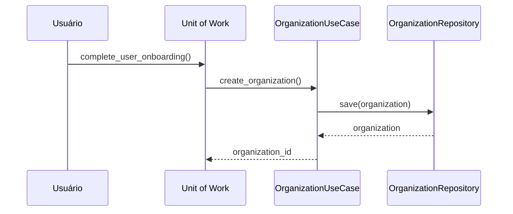
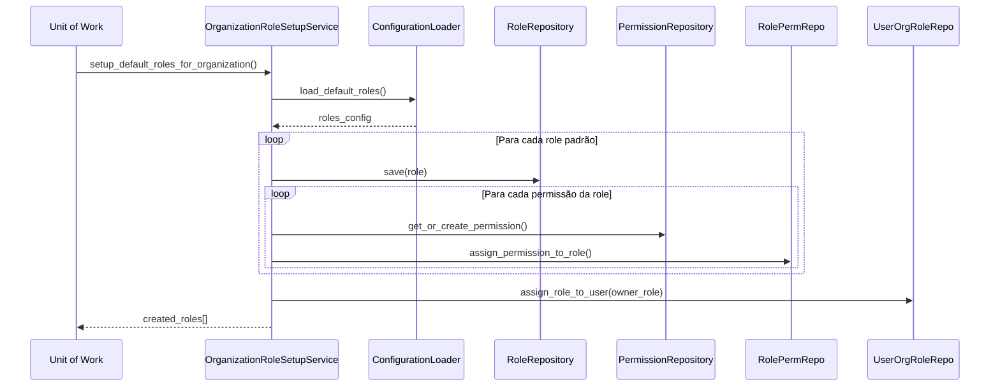
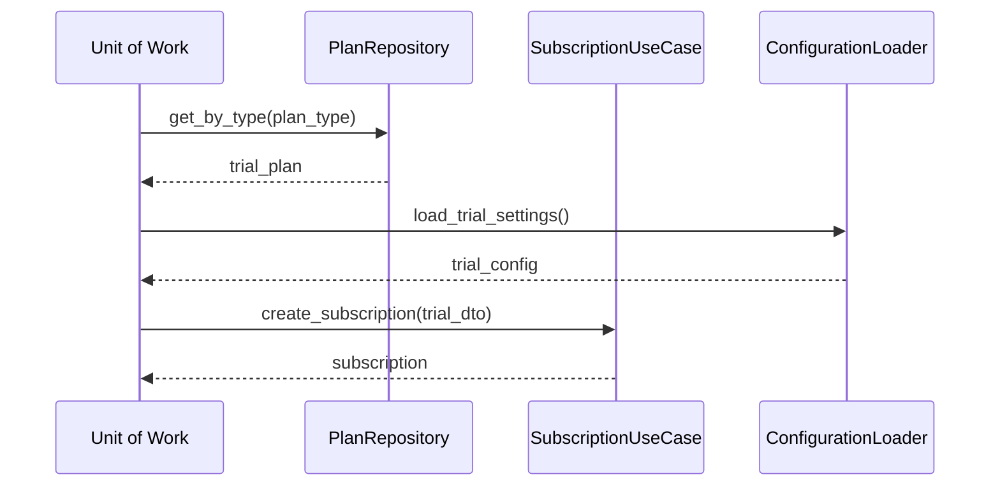
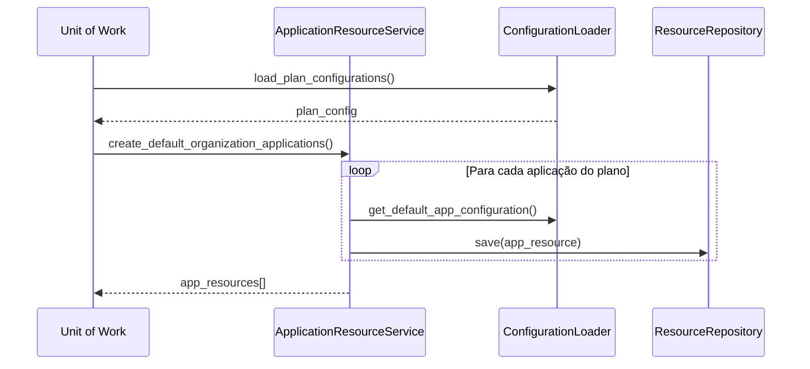
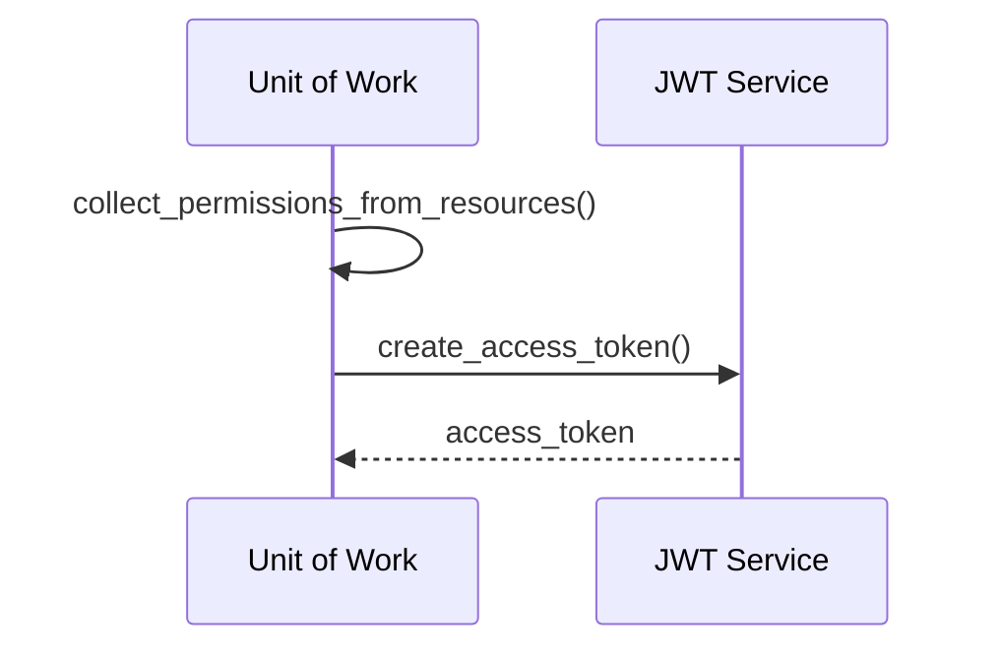

# Fluxo de Onboarding do Usuário

## Visão Geral

Este documento detalha o fluxo completo de onboarding de usuários na plataforma multi-tenant, desde o registro até a configuração inicial das aplicações e recursos.

## Arquitetura do Sistema

O sistema utiliza uma arquitetura baseada em **recursos** (resource-based applications) que trata aplicações como recursos com permissões, simplificando o gerenciamento de acesso e configurações.

### Componentes Principais

- **SimpleOnboardingUseCase**: Orquestra todo o fluxo de onboarding
- **OrganizationUseCase**: Gerencia criação de organizações (tenants)
- **SubscriptionUseCase**: Gerencia assinaturas e planos
- **OrganizationRoleSetupService**: Configura roles e permissões padrão
- **ApplicationResourceService**: Cria e configura aplicações como recursos
- **ConfigurationLoaderService**: Carrega configurações JSON

## Fluxo Detalhado de Onboarding

### 1. Criação da Organização (Tenant)



**Detalhes:**
- Cria uma nova organização usando `OrganizationCreateDTO`
- A organização serve como tenant isolado para o usuário
- Cada organização é um contexto separado com seus próprios recursos

### 2. Configuração de Roles e Permissões



**Roles Padrão Criadas:**

#### 🔑 **Owner** (Proprietário)
- **Descrição**: Proprietário da organização com acesso completo
- **Permissões**: `organization:*`, `user:*`, `role:*`, `permission:*`, `resource:*`, `application:*`, `document:*`
- **Características**: Role de sistema, não pode ser deletada
- **Atribuída**: Automaticamente ao criador da organização

#### 👨‍💼 **Admin** (Administrador)
- **Descrição**: Administrador com acesso de gerenciamento
- **Permissões**: Gerenciamento de usuários, roles, recursos e aplicações
- **Características**: Role de sistema, não pode ser deletada

#### 👥 **Member** (Membro)
- **Descrição**: Membro padrão com acesso standard
- **Permissões**: Leitura, uso de aplicações, criação/edição de documentos
- **Características**: Role de sistema, não pode ser deletada

#### 👀 **Viewer** (Visualizador)
- **Descrição**: Acesso somente leitura
- **Permissões**: Apenas leitura de recursos e download de documentos
- **Características**: Role de sistema, não pode ser deletada

### 3. Criação da Assinatura (Trial)



**Configurações de Trial:**
- **Duração**: 30 dias (configurável via JSON)
- **Ciclo de Cobrança**: Mensal
- **Metadata**: `{"is_trial": true, "created_via": "onboarding"}`
- **Status**: Ativo automaticamente

### 4. Criação de Aplicações por Plano



**Aplicações por Plano:**

#### 📊 **Plano Basic**
- **Web Chat App**: Chat em tempo real para websites
- **Management App**: Gerenciamento de usuários e configurações
- **Document Storage**: Armazenamento e busca de documentos

#### 🚀 **Plano Premium**
- Todas as aplicações do Basic +
- **API Access**: Acesso via REST API e webhooks

#### 🏢 **Plano Enterprise**
- Todas as aplicações do Premium +
- **WhatsApp App**: Integração com WhatsApp Business

### 5. Geração do Token de Acesso



**Token JWT Inclui:**
- `user_id`: ID do usuário
- `organization_id`: ID da organização
- `permissions`: Lista de permissões dos recursos
- `roles`: ["organization_owner"]
- `exp`: Expiração do token

### 6. Geração de Próximos Passos

O sistema gera automaticamente uma lista de próximos passos personalizados baseados nas aplicações criadas:

#### 📧 **Passos Comuns**
- **Verificar Email**: Prioridade alta, 2 minutos

#### 💬 **Web Chat App**
- **Configurar Widget**: Personalizar configurações do chat
- **Incorporar Widget**: Adicionar widget ao website

#### 📱 **WhatsApp App** (Enterprise)
- **Configurar WhatsApp**: Conectar conta WhatsApp Business

#### 📄 **Document Storage**
- **Upload de Documentos**: Fazer upload dos primeiros documentos
- **Configurar Permissões**: Definir acessos aos documentos

#### 👥 **Management App**
- **Convidar Membros**: Convidar membros da equipe

## Configurações Baseadas em JSON

### Estrutura de Configurações

```
src/shared/config/defaults/
├── roles/
│   └── default_roles.json           # Roles e permissões padrão
├── applications/
│   ├── application_types.json       # Tipos de aplicação
│   ├── plan_configurations.json     # Aplicações por plano
│   └── app_configs/                 # Configurações específicas
│       ├── web_chat_app.json
│       ├── whatsapp_app.json
│       ├── document_storage.json
│       ├── management_app.json
│       └── api_access.json
└── subscription/
    └── trial_settings.json          # Configurações de trial
```

### Templates Dinâmicos

O sistema suporta templates nas configurações:

```json
{
  "api_key": "generated_uuid",
  "docs_url": "/api/docs/org/{organization_id}"
}
```

**Variáveis Disponíveis:**
- `generated_uuid`: Gera UUID único
- `{organization_id}`: ID da organização
- `{user_id}`: ID do usuário

## Transações e Rollback

Todo o fluxo de onboarding é executado dentro de uma **Unit of Work**, garantindo que:

- ✅ **Atomicidade**: Ou todas as operações são realizadas com sucesso, ou nenhuma
- ✅ **Consistência**: O estado do sistema permanece consistente
- ✅ **Rollback Automático**: Em caso de erro, todas as alterações são desfeitas

```python
with self._uow:
    # 1. Criar organização
    # 2. Configurar roles
    # 3. Criar assinatura
    # 4. Criar aplicações
    # 5. Gerar token
    
    # Se qualquer etapa falhar, todas são desfeitas automaticamente
```

## Resposta do Onboarding

### Sucesso

```json
{
  "success": true,
  "organization": {
    "id": "uuid",
    "name": "Nome da Organização",
    "created_at": "2024-01-01T00:00:00Z"
  },
  "subscription": {
    "id": "uuid",
    "plan_id": "uuid",
    "plan_name": "basic",
    "status": "active",
    "is_trial": true,
    "billing_cycle": "monthly",
    "starts_at": "2024-01-01T00:00:00Z",
    "ends_at": "2024-01-31T00:00:00Z"
  },
  "roles": [
    {
      "id": "uuid",
      "name": "owner",
      "description": "Organization owner with full access",
      "is_system_role": true,
      "created_at": "2024-01-01T00:00:00Z"
    }
  ],
  "applications": [
    {
      "id": "uuid",
      "type": "web_chat_app",
      "name": "Chat Web",
      "description": "Chat em tempo real para websites",
      "status": "active",
      "features": ["live_chat", "chat_history"],
      "required_permissions": ["application:use", "chat:read"]
    }
  ],
  "access_token": "jwt_token_here",
  "setup_completed_at": "2024-01-01T00:00:00Z",
  "next_steps": [
    {
      "step": "verify_email",
      "title": "Verify Your Email",
      "description": "Check your email and click the verification link",
      "priority": "high",
      "estimated_time": "2 minutes"
    }
  ]
}
```

### Erro

```json
{
  "success": false,
  "error": "Descrição do erro",
  "error_type": "TipoDoErro",
  "timestamp": "2024-01-01T00:00:00Z"
}
```

## Métodos Auxiliares

### `get_organization_applications(organization_id)`
- Lista todas as aplicações de uma organização
- Retorna informações básicas de cada aplicação

### `enable_application_feature(organization_id, app_resource_id, feature)`
- Habilita uma feature específica em uma aplicação
- Valida se a organização possui acesso à aplicação

### `validate_user_application_access(user_id, organization_id, app_resource_id, user_permissions)`
- Valida se um usuário pode acessar uma aplicação específica
- Usa o sistema RBAC/ABAC para verificação de permissões

### `create_custom_application(organization_id, owner_id, app_type, custom_config)`
- Cria uma aplicação personalizada com configurações específicas
- Permite override das configurações padrão

## Segurança e Auditoria

### Princípios de Segurança

1. **Fail-Safe**: Em caso de erro, o sistema nega acesso por padrão
2. **Princípio do Menor Privilégio**: Usuários recebem apenas as permissões necessárias
3. **Isolamento de Tenants**: Cada organização é completamente isolada
4. **Auditoria Completa**: Todas as operações são registradas

### Logs de Auditoria

O sistema registra automaticamente:
- Criação de organizações
- Atribuição de roles
- Criação de aplicações
- Geração de tokens de acesso
- Falhas de segurança

## Configuração de Desenvolvimento

### Variáveis de Ambiente

```bash
# Configuração de trial
TRIAL_DURATION_DAYS=30
TRIAL_BILLING_CYCLE=monthly

# Configuração de JWT
JWT_SECRET_KEY=your_secret_key
JWT_EXPIRATION_HOURS=24

# Configuração de aplicações
DEFAULT_PLAN_TYPE=basic
CONFIG_BASE_PATH=/path/to/config
```

### Executando o Onboarding

```python
from src.iam.application.use_cases.simple_onboarding_use_case import SimpleOnboardingUseCase

# Inicializar use case
onboarding_uc = SimpleOnboardingUseCase(organization_use_case, uow)

# Executar onboarding
result = onboarding_uc.complete_user_onboarding(
    user_id=user_uuid,
    organization_name="Minha Empresa",
    plan_type="basic"
)

if result["success"]:
    print(f"Onboarding concluído! Token: {result['access_token']}")
else:
    print(f"Erro no onboarding: {result['error']}")
```

## Testes

### Cenários de Teste

1. **Onboarding Completo com Sucesso**
2. **Falha na Criação da Organização**
3. **Falha na Configuração de Roles**
4. **Falha na Criação da Assinatura**
5. **Falha na Criação de Aplicações**
6. **Rollback em Caso de Erro**

### Testes de Integração

```python
def test_complete_onboarding_success():
    result = onboarding_uc.complete_user_onboarding(
        user_id=test_user_id,
        organization_name="Test Org",
        plan_type="basic"
    )
    
    assert result["success"] is True
    assert "organization" in result
    assert "subscription" in result
    assert "applications" in result
    assert len(result["applications"]) == 3  # basic plan apps
```

## Monitoramento e Métricas

### Métricas Importantes

- **Taxa de Sucesso do Onboarding**: % de onboardings concluídos com sucesso
- **Tempo Médio de Onboarding**: Tempo para completar o processo
- **Distribuição de Planos**: Quantos usuários escolhem cada plano
- **Aplicações Mais Utilizadas**: Quais aplicações são mais acessadas
- **Taxa de Conversão Trial→Pago**: % de usuários que convertem após trial

### Alertas

- Falhas consecutivas no onboarding
- Tempo de onboarding acima do normal
- Erros de configuração JSON
- Falhas na criação de assinaturas

## Roadmap e Melhorias Futuras

### Próximas Funcionalidades

1. **Onboarding Guiado**: Interface step-by-step para usuários
2. **Templates de Organização**: Configurações pré-definidas por setor
3. **Integração com Provedores de Pagamento**: Automação de billing
4. **Analytics de Onboarding**: Dashboard com métricas detalhadas
5. **Personalização de Planos**: Criação de planos customizados
6. **Migração Entre Planos**: Upgrade/downgrade automático

### Otimizações Técnicas

1. **Cache de Configurações**: Melhorar performance de carregamento
2. **Onboarding Assíncrono**: Processamento em background
3. **Webhooks de Onboarding**: Notificações para sistemas externos
4. **Backup Automático**: Snapshots antes de operações críticas

---

**Última Atualização**: 2025-06-07
**Versão**: 1.0  
**Autor**: Sistema de Onboarding Multi-Tenant