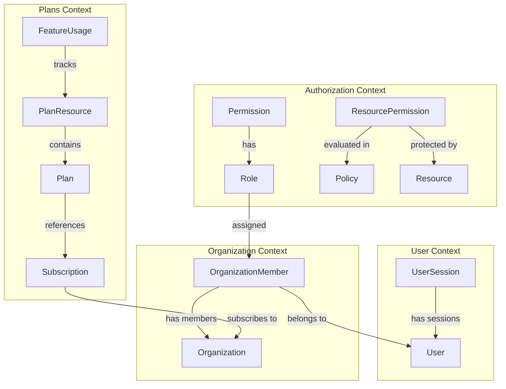
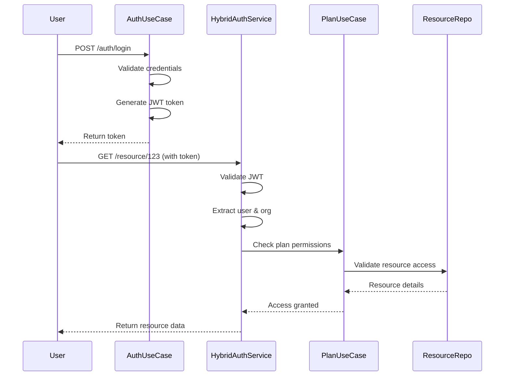
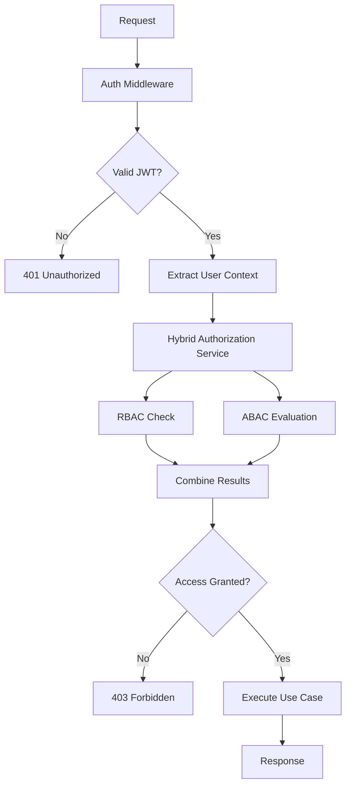
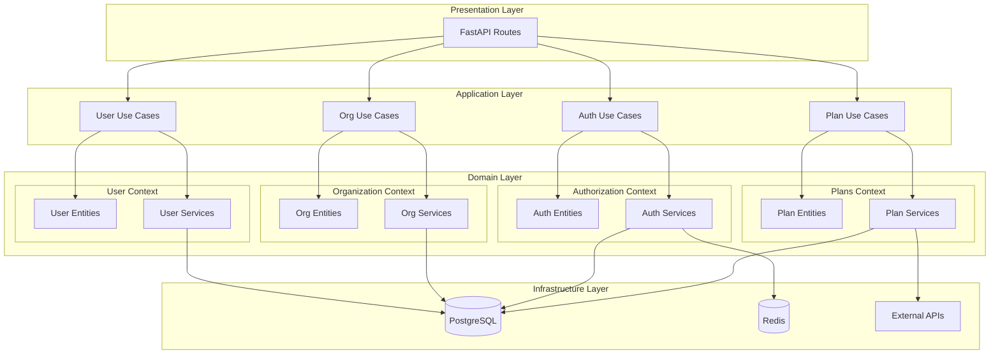

# Documentação Técnica - Sistema Multi-Tenant DDD

## 1. Estrutura do Projeto

### 1.1 Organização em Bounded Contexts

O projeto está organizado em quatro contextos limitados principais:

```
src/
├── user/                    # Autenticação, sessões e gestão de usuários
├── organization/            # Gestão de organizações, membros e configurações
├── authorization/           # Controle de acesso via RBAC + ABAC
├── plans/                   # Planos customizáveis com recursos
└── shared/                  # Componentes compartilhados
```

#### **User Context** - Autenticação e Gestão de Usuários
- **Responsabilidades**: Autenticação JWT, sessões de usuário, perfis
- **Entidades Principais**: `User`, `UserSession`
- **Serviços**: `AuthService`, `UserDomainService`

#### **Organization Context** - Gestão Organizacional
- **Responsabilidades**: Organizações, membros, configurações multi-tenant
- **Entidades Principais**: `Organization`, `OrganizationMember`
- **Serviços**: `OrganizationDomainService`

#### **Authorization Context** - Controle de Acesso
- **Responsabilidades**: RBAC + ABAC, políticas, permissões
- **Entidades Principais**: `Role`, `Permission`, `Policy`, `Resource`
- **Serviços**: `HybridAuthorizationService`, `PolicyEvaluationService`

#### **Plans Context** - Planos e Recursos
- **Responsabilidades**: Planos customizáveis, assinaturas, recursos como chat
- **Entidades Principais**: `Plan`, `Subscription`, `PlanResource`
- **Serviços**: `PlanResourceService`, `SubscriptionService`

### 1.2 Divisão em Camadas

Cada bounded context segue a mesma estrutura de camadas:

```
context/
├── domain/
│   ├── entities/            # Entidades de domínio
│   ├── value_objects/       # Objetos de valor
│   ├── repositories/        # Interfaces de repositório
│   └── services/            # Serviços de domínio
├── application/
│   ├── use_cases/           # Casos de uso
│   └── dtos/               # Data Transfer Objects
├── infrastructure/
│   ├── repositories/        # Implementações SQLAlchemy
│   ├── models/             # Modelos de banco
│   └── unit_of_work.py     # Unit of Work pattern
└── presentation/
    ├── routes/             # Rotas FastAPI
    ├── dependencies.py     # Injeção de dependência
    └── routers.py          # Configuração de routers
```

### 1.3 Diagrama de Relacionamentos



## 2. Entidades de Domínio

### 2.1 User Context

| Entidade | Propriedades | Responsabilidades |
|----------|-------------|-------------------|
| **User** | `id`, `email: Email`, `password: Password`, `full_name`, `is_active`, `last_login_at` | Validação de email, hash de senha, controle de ativação |
| **UserSession** | `id`, `user_id`, `token`, `expires_at`, `is_active`, `metadata` | Validação JWT, controle de expiração, invalidação |

**Objetos de Valor:**
- `Email`: Validação de formato de email
- `Password`: Hash bcrypt, validação de força

### 2.2 Organization Context

| Entidade | Propriedades | Responsabilidades |
|----------|-------------|-------------------|
| **Organization** | `id`, `name: OrganizationName`, `settings: OrganizationSettings`, `max_users`, `is_active` | Nome único, configurações, limite de usuários |
| **OrganizationMember** | `id`, `user_id`, `organization_id`, `role`, `joined_at`, `is_active` | Relacionamento user-org, controle de papéis |

**Objetos de Valor:**
- `OrganizationName`: Nome único validado
- `OrganizationSettings`: Configurações customizáveis

### 2.3 Authorization Context

| Entidade | Propriedades | Responsabilidades |
|----------|-------------|-------------------|
| **Role** | `id`, `name`, `permissions: List[Permission]`, `organization_id` | Agrupamento de permissões, escopo organizacional |
| **Permission** | `id`, `action`, `resource_type`, `conditions`, `priority` | Ação específica em tipo de recurso |
| **Policy** | `id`, `name`, `effect`, `conditions`, `priority`, `organization_id` | Regras ABAC com condições dinâmicas |
| **Resource** | `id`, `name`, `resource_type`, `parent_id`, `metadata`, `organization_id` | Recursos hierárquicos com metadados |
| **ResourcePermission** | `id`, `resource_id`, `role_id`, `permission_id`, `policy_id` | Ligação recurso-permissão-política |

### 2.4 Plans Context

| Entidade | Propriedades | Responsabilidades |
|----------|-------------|-------------------|
| **Plan** | `id`, `name: PlanName`, `plan_type`, `resources`, `price_monthly`, `price_yearly` | Planos com recursos customizáveis |
| **Subscription** | `id`, `organization_id`, `plan_id`, `status`, `billing_cycle`, `starts_at`, `ends_at` | Assinatura de planos, ciclo de billing |
| **PlanResource** | `id`, `plan_id`, `resource_type`, `configuration`, `is_enabled`, `limits` | Recursos específicos (chat_whatsapp, chat_iframe) |
| **FeatureUsage** | `id`, `organization_id`, `resource_type`, `usage_count`, `usage_date`, `cost` | Monitoramento de uso e limites |

## 3. Regras de Negócio

### 3.1 Isolamento Multi-Tenant
- **Regra**: Usuários só acessam recursos da sua organização
- **Implementação**: Filtro automático por `organization_id` em todas as consultas
- **Validação**: Middleware de autorização verifica pertencimento

### 3.2 Sistema de Autorização Híbrido (RBAC + ABAC)

```python
# Exemplo de avaliação de política ABAC
class Policy:
    def evaluate(self, context: AuthorizationContext) -> PolicyResult:
        # Regra: Usuários de engenharia podem acessar projetos do seu departamento
        if (context.user.department == 'engineering' and 
            context.resource.metadata.get('department') == 'engineering'):
            return PolicyResult(effect='allow', priority=100)
        
        # DENY tem precedência sobre ALLOW
        if context.resource.is_sensitive and not context.user.is_admin:
            return PolicyResult(effect='deny', priority=200)
```

**⚠️ Aviso**: Prioridade ABAC sobrescreve RBAC. Regras `deny` têm precedência sobre `allow`.

### 3.3 Validação de Configuração de Recursos

```python
# Exemplo de validação para chat_whatsapp
class PlanResourceService:
    def validate_whatsapp_config(self, config: Dict[str, Any]) -> Dict[str, Any]:
        required_fields = ['api_key', 'webhook_url', 'phone_number']
        for field in required_fields:
            if field not in config:
                raise ValueError(f"Campo obrigatório ausente: {field}")
        
        # Teste de conectividade
        if not self._test_whatsapp_api(config['api_key']):
            raise ValueError("API key do WhatsApp inválida")
        
        return config
```

### 3.4 Controle de Limites
- **Limite de Usuários**: Organizações não podem exceder `max_users` do plano
- **Limite de Recursos**: Recursos têm limites configuráveis (ex: 5000 mensagens/dia)
- **Implementação**: `FeatureUsageService` monitora e bloqueia quando necessário

## 4. Requisitos Funcionais

### 4.1 Autenticação e Sessões
- [ ] Login via email/senha com geração de JWT
- [ ] Controle de sessões ativas por usuário
- [ ] Logout com invalidação de token
- [ ] Refresh token automático

### 4.2 Gestão de Organizações
- [ ] Criação de organizações com validação de nome único
- [ ] Adição/remoção de membros com controle de papéis
- [ ] Transferência de propriedade
- [ ] Configurações personalizáveis por organização

### 4.3 Sistema de Autorização
- [ ] Definição de papéis (RBAC) por organização
- [ ] Criação de políticas ABAC com condições dinâmicas
- [ ] Avaliação combinada RBAC + ABAC
- [ ] Recursos hierárquicos com herança de permissões

### 4.4 Planos e Assinaturas
- [ ] Criação de planos com recursos customizáveis
- [ ] Assinatura de planos por organizações
- [ ] Configuração de recursos (chat_whatsapp, chat_iframe)
- [ ] Monitoramento de uso e aplicação de limites

### 4.5 Auditoria
- [ ] Log de todas as requisições de autorização
- [ ] Rastreamento de uso de recursos
- [ ] Histórico de alterações em configurações

## 5. Requisitos Não Funcionais

| Categoria | Requisito | Implementação |
|-----------|-----------|---------------|
| **Escalabilidade** | Suporte a múltiplas organizações | Particionamento por `organization_id` |
| **Segurança** | Criptografia de senhas | Bcrypt com salt |
| **Segurança** | Validação JWT | Middleware de autenticação |
| **Segurança** | Isolamento de dados | Filtros automáticos multi-tenant |
| **Desempenho** | Cache de permissões | Redis com TTL configurável |
| **Desempenho** | Indexação crítica | Índices em `user_id`, `organization_id`, `resource_id` |
| **Flexibilidade** | Migração async | Unit of Work abstrato preparado |
| **Testabilidade** | DTOs claros | Interfaces abstratas para mocks |

## 6. Partes Mais Complexas da Aplicação

### 6.1 Sistema de Autorização (RBAC + ABAC)

**Complexidade**: Combinar permissões baseadas em papéis com condições dinâmicas.

```python
class HybridAuthorizationService:
    async def can_access_resource(
        self, 
        user: User, 
        resource: Resource, 
        action: str
    ) -> bool:
        # 1. Verificar permissões RBAC
        rbac_permissions = await self._get_rbac_permissions(user, resource)
        
        # 2. Avaliar políticas ABAC
        abac_results = await self._evaluate_abac_policies(user, resource, action)
        
        # 3. Resolver conflitos (DENY tem precedência)
        final_decision = self._resolve_conflicts(rbac_permissions, abac_results)
        
        return final_decision.effect == 'allow'
    
    def _resolve_conflicts(self, rbac: List[Permission], abac: List[PolicyResult]) -> PolicyResult:
        # Ordenar por prioridade (maior primeiro)
        all_results = sorted(rbac + abac, key=lambda x: x.priority, reverse=True)
        
        # Primeiro DENY encontrado prevalece
        for result in all_results:
            if result.effect == 'deny':
                return result
        
        # Se não há DENY, primeiro ALLOW prevalece
        for result in all_results:
            if result.effect == 'allow':
                return result
        
        # Default: DENY
        return PolicyResult(effect='deny', priority=0)
```

**⚠️ Desafios Técnicos**:
- Resolver conflitos entre regras RBAC e ABAC
- Validar sintaxe de condições ABAC em tempo de execução
- Performance com muitas políticas complexas

### 6.2 Gestão de Planos Customizáveis

**Complexidade**: Validação dinâmica de configurações por tipo de recurso.

```python
class PlanResourceService:
    def validate_configuration(
        self, 
        resource_type: PlanResourceType, 
        configuration: Dict[str, Any]
    ) -> Dict[str, Any]:
        validators = {
            PlanResourceType.CHAT_WHATSAPP: self._validate_whatsapp_config,
            PlanResourceType.CHAT_IFRAME: self._validate_iframe_config,
            PlanResourceType.CUSTOM: self._validate_custom_config
        }
        
        validator = validators.get(resource_type)
        if not validator:
            raise ValueError(f"Tipo de recurso não suportado: {resource_type}")
        
        return validator(configuration)
    
    def _validate_whatsapp_config(self, config: Dict[str, Any]) -> Dict[str, Any]:
        # Campos obrigatórios
        required = ['api_key', 'webhook_url', 'phone_number']
        missing = [field for field in required if field not in config]
        if missing:
            raise ValueError(f"Campos obrigatórios ausentes: {missing}")
        
        # Teste de conectividade real
        if not self._test_whatsapp_connectivity(config):
            raise ValueError("Não foi possível conectar com a API do WhatsApp")
        
        # Validar limites
        limits = config.get('limits', {})
        if 'daily_messages' in limits and limits['daily_messages'] > 10000:
            raise ValueError("Limite diário não pode exceder 10.000 mensagens")
        
        return config
```

**⚠️ Desafios Técnicos**:
- Validação de APIs externas (WhatsApp, Telegram, etc.)
- Testes de integração para cada tipo de recurso
- Versionamento de configurações quando APIs mudam

### 6.3 Multi-Tenancy

**Complexidade**: Garantir isolamento absoluto de dados entre organizações.

```python
class BaseRepository:
    def _add_tenant_filter(self, query: Query, organization_id: UUID) -> Query:
        """Adiciona filtro de tenant automaticamente"""
        return query.filter(self.model.organization_id == organization_id)
    
    def find_by_id(self, entity_id: UUID, organization_id: UUID) -> Optional[Entity]:
        """Busca sempre inclui validação de tenant"""
        query = select(self.model).where(
            and_(
                self.model.id == entity_id,
                self.model.organization_id == organization_id
            )
        )
        result = self.session.execute(query)
        return result.scalar_one_or_none()

# Middleware de validação
class TenantValidationMiddleware:
    async def __call__(self, request: Request, call_next):
        # Extrair organization_id do token JWT
        organization_id = self._extract_org_from_token(request)
        
        # Adicionar ao contexto da requisição
        request.state.organization_id = organization_id
        
        response = await call_next(request)
        return response
```

**⚠️ Desafios Técnicos**:
- Evitar vazamento de dados entre tenants
- Performance com muitas organizações
- Testes de isolamento automatizados

## 7. Exemplos de Casos de Uso

### 7.1 Caso de Uso: Autenticação e Acesso a Recurso



**Fluxo Detalhado**:
1. **Autenticação**: `AuthUseCase.authenticate()` valida credenciais e gera JWT
2. **Autorização**: `HybridAuthorizationService.can_access_resource()` combina RBAC + ABAC
3. **Validação de Plano**: `PlanUseCase.validate_resource_access()` verifica se recurso está no plano
4. **Retorno**: Dados do recurso ou erro de acesso negado

### 7.2 Caso de Uso: Assinatura de Plano Premium

```python
async def subscribe_to_premium_plan(
    self, 
    organization_id: UUID, 
    plan_id: UUID
) -> SubscriptionResponseDTO:
    """
    Fluxo completo de assinatura de plano
    """
    with self._uow:
        # 1. Validar plano existe e está ativo
        plan = await self._plan_repository.find_by_id(plan_id)
        if not plan or not plan.is_active:
            raise ValueError("Plano não encontrado ou inativo")
        
        # 2. Verificar se organização já tem assinatura ativa
        existing = await self._subscription_repository.find_active_by_organization(
            organization_id
        )
        if existing:
            raise ValueError("Organização já possui assinatura ativa")
        
        # 3. Criar assinatura
        subscription = await self._subscription_service.create_subscription(
            organization_id=organization_id,
            plan_id=plan_id,
            billing_cycle=BillingCycle.MONTHLY
        )
        
        # 4. Criar permissões automáticas para recursos do plano
        for resource in plan.resources:
            await self._create_plan_resource_permissions(
                organization_id, 
                resource
            )
        
        # 5. Notificar sistema de billing
        await self._billing_service.setup_billing(subscription)
    
    return self._build_subscription_response(subscription)
```

### 7.3 Caso de Uso: Controle de Limite de Mensagens

```python
async def check_whatsapp_message_limit(
    self, 
    organization_id: UUID, 
    message_count: int = 1
) -> bool:
    """
    Verifica se organização pode enviar mensagens WhatsApp
    """
    # 1. Buscar configuração do recurso no plano
    resource = await self._get_whatsapp_resource(organization_id)
    if not resource or not resource.is_enabled:
        raise ValueError("Recurso WhatsApp não disponível no plano")
    
    # 2. Verificar limite diário
    daily_limit = resource.limits.get('daily_messages', 1000)
    today_usage = await self._feature_usage_repo.get_daily_usage(
        organization_id, 
        PlanResourceType.CHAT_WHATSAPP,
        date.today()
    )
    
    # 3. Validar se pode enviar
    if today_usage + message_count > daily_limit:
        # Log para auditoria
        await self._audit_service.log_limit_exceeded(
            organization_id, 
            'whatsapp_daily_limit',
            {'current': today_usage, 'limit': daily_limit}
        )
        return False
    
    # 4. Registrar uso
    await self._feature_usage_repo.record_usage(
        organization_id=organization_id,
        resource_type=PlanResourceType.CHAT_WHATSAPP,
        usage_count=message_count,
        usage_date=datetime.utcnow()
    )
    
    return True
```

### 7.4 Estratégia de Migração para Async/Await

```python
# Atual: Síncrono
class UserUseCase:
    def __init__(self, uow: UnitOfWork):
        self._uow = uow
    
    def create_user(self, dto: UserCreateDTO) -> UserResponseDTO:
        with self._uow:
            user = User.create(...)
            saved_user = self._user_repository.save(user)
        return self._build_response(saved_user)

# Futuro: Assíncrono
class UserUseCase:
    def __init__(self, uow: AsyncUnitOfWork):
        self._uow = uow
    
    async def create_user(self, dto: UserCreateDTO) -> UserResponseDTO:
        async with self._uow:
            user = User.create(...)
            saved_user = await self._user_repository.save(user)
        return self._build_response(saved_user)

# Unit of Work abstrato permite transição suave
class AsyncSQLAlchemyUnitOfWork(AsyncUnitOfWork):
    async def __aenter__(self):
        return self
    
    async def __aexit__(self, exc_type, exc_val, exc_tb):
        if exc_type:
            await self.session.rollback()
        else:
            await self.session.commit()
```

## 8. Diagramas de Arquitetura

### 8.1 Fluxo de Autorização



### 8.2 Arquitetura de Bounded Contexts



---

**⚠️ Avisos Importantes**:
- **Governança de Dados**: Implementar políticas claras de retenção e anonimização
- **Testes de Hierarquia**: Recursos hierárquicos precisam de testes específicos para herança de permissões
- **Performance**: Monitorar queries com muitas JOINs, especialmente em avaliações ABAC complexas
- **Segurança**: Auditar regularmente configurações de recursos externos (APIs do WhatsApp, etc.)